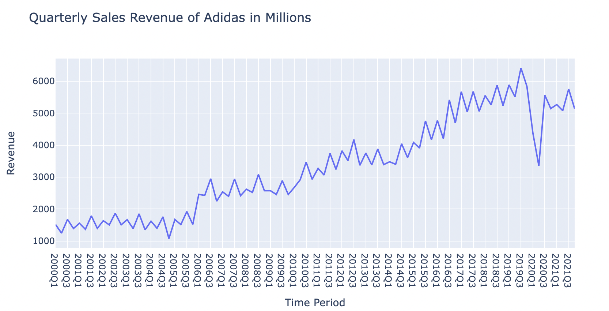
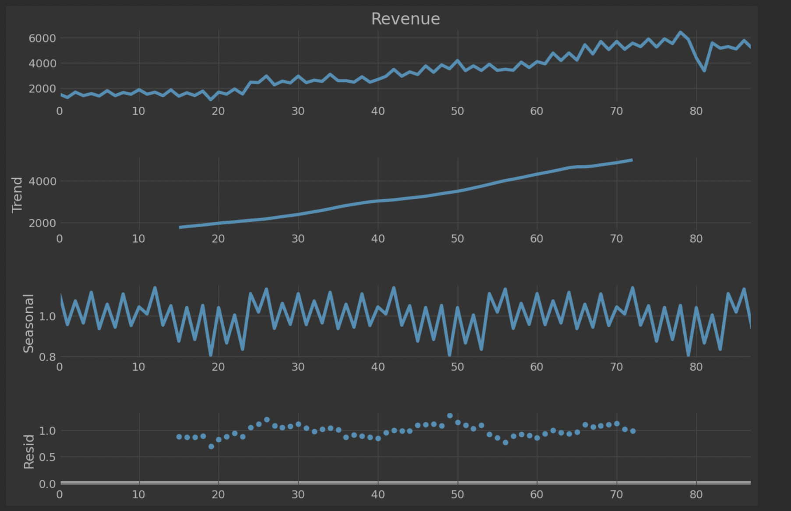
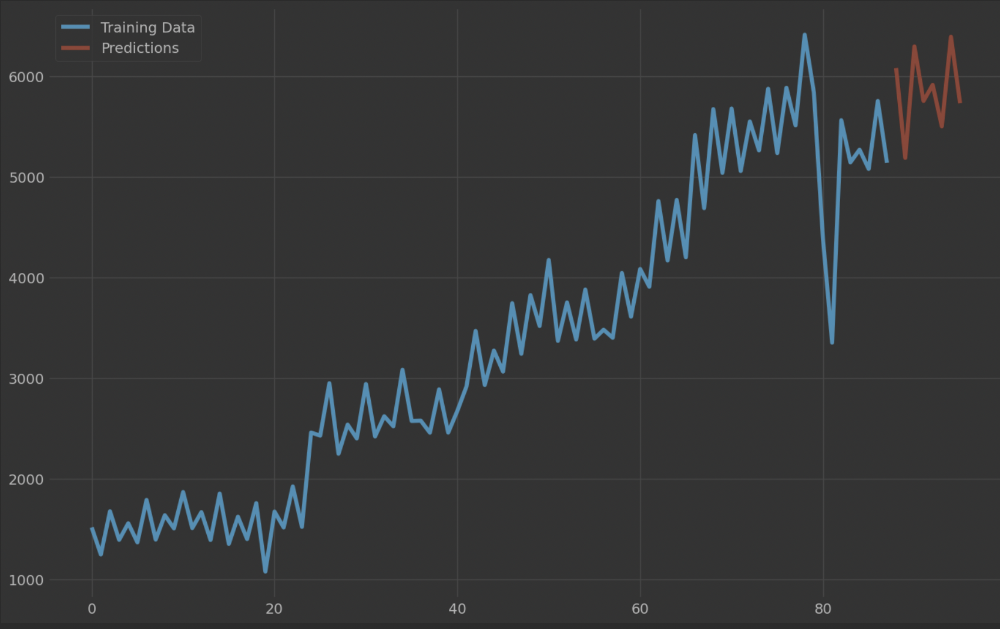

# Business Forecasting Using SARIMA model

Business forecasting is the process of using historical data to predict future sales, expenditure, or revenue for a business. It is a valuable tool for businesses to make better informed decisions and improve their future performance.

This project demonstrates how to perform business forecasting using Python and the [Adidas quarterly sales data](https://statso.io/quarterly-revenue-analysis-case-study/). The data contains the quarterly revenue of Adidas from 2000 to 2021 in millions (euros).

## Dependencies

To run this project, you will need to have the following Python libraries installed:

- pandas 
- matplotlib 
- statsmodels

`install them using pip install pandas matplotlib statsmodels
`

## Procedure
1. Import necessary libraries and the Adidas dataset.
2. Check for seasonality in the data using a time series plot.
3. Find the values of p, d, and q for the SARIMA model using autocorrelation and partial autocorrelation plots.
4. Train the SARIMA model using the determined values of p, d, and q.
5. Forecast the quarterly revenue of Adidas for the next eight quarters using the trained SARIMA model.

## Analysis

### Quarterly sales revenue of Adidas

## Check the seasonality

## Seasonal ARIMA (SARIMA) model Predictions

## Conclusion
In this project, we learned how to perform business forecasting using Python and the SARIMA model. We used the Adidas quarterly sales data to forecast future revenue and checked for seasonality in the data. By following these steps, you will be able to use business forecasting techniques to make better informed decisions for your own business.
